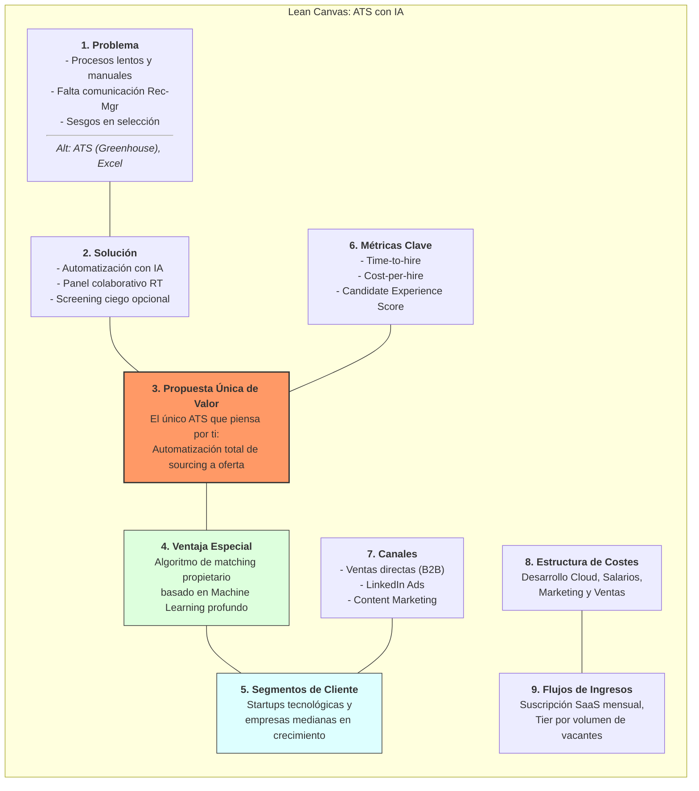
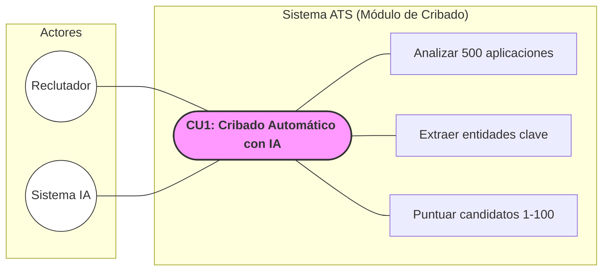
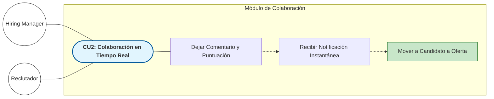
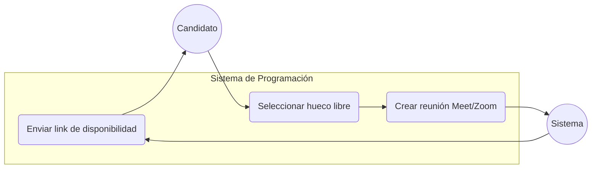
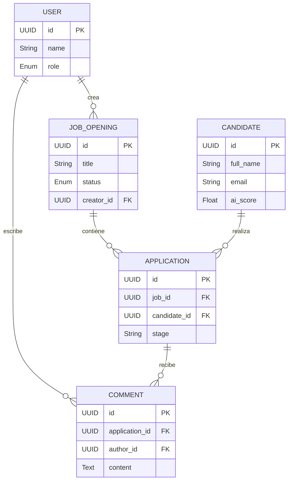
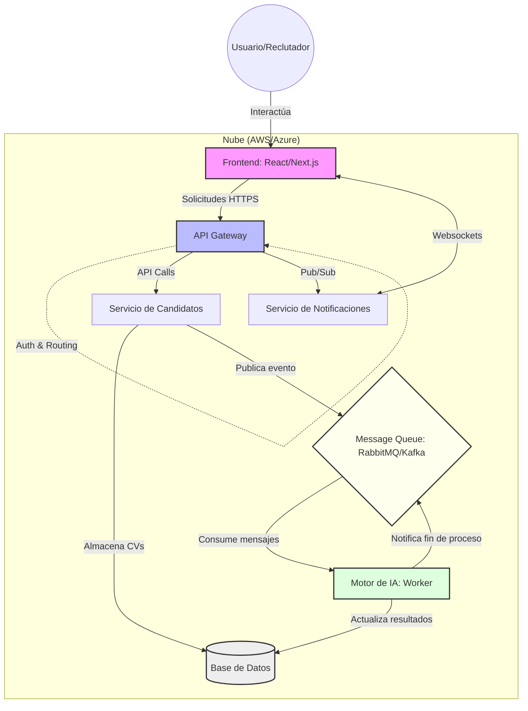

# Documentación de Producto: LTI - El ATS del Futuro

## 1. Descripción del Software, Valor Añadido y Ventajas Competitivas

**LTI (Lead Talent Intelligence)** es una plataforma SaaS de próxima generación diseñada para transformar el ciclo de vida del reclutamiento. A diferencia de los ATS tradicionales que actúan como simples bases de datos, LTI es un motor de inteligencia activa.

### Valor Añadido
LTI elimina la carga administrativa de los departamentos de RRHH mediante el uso de **IA Generativa y Predictiva**, permitiendo que los reclutadores se centren en lo que importa: la conexión humana.

### Ventajas Competitivas
1.  **IA Nativa (No un parche):** Clasificación automática de candidatos basada en fit cultural y técnico real, no solo palabras clave.
2.  **Colaboración en Tiempo Real:** Interfaz tipo "War Room" donde managers y reclutadores interactúan sobre perfiles en vivo.
3.  **Automatización Hiper-Personalizada:** Workflows que envían mensajes personalizados y programan entrevistas sin intervención humana.
4.  **Analítica Predictiva:** Predice el tiempo de contratación y la probabilidad de retención del candidato.

---

## 2. Funciones Principales

-   **AI Sourcing & Screening:** Análisis automático de CVs y perfiles sociales con ranking de relevancia.
-   **Collaborative Hiring Hub:** Chat integrado, sistema de votación rápida y feedback compartido en fichas de candidato.
-   **Smart Scheduling:** Integración con calendarios para autoprogramación de entrevistas basadas en disponibilidad de ambas partes.
-   **Automated Pipeline Triggers:** Movimiento automático de candidatos entre fases basado en evaluaciones o tests técnicos.
-   **IA Co-Pilot:** Redacción de descripciones de puesto y correos electrónicos con tono de marca ajustable.

---

## 3. Lean Canvas

| **Problema** | **Solución** | **Propuesta Única de Valor** | **Ventaja Especial** | **Segmentos de Cliente** |
| :--- | :--- | :--- | :--- | :--- |
| - Procesos lentos y manuales.<br>- Falta de comunicación Reclutador-Manager.<br>- Sesgos en la selección. | - Automatización con IA.<br>- Panel colaborativo en tiempo real.<br>- Screening ciego opcional. | El único ATS que piensa por ti: Automatización total desde el sourcing hasta la oferta. | Algoritmo de matching propietario basado en Machine Learning profundo. | Startups tecnológicas y empresas medianas en crecimiento. |
| **Alternativas Existentes** | **Métricas Clave** | **Canales** | **Estructura de Costes** | **Flujos de Ingresos** |
| ATS tradicionales (Greenhouse, Lever), Excel. | Time-to-hire, Cost-per-hire, Candidate Experience Score. | Ventas directas (B2B), LinkedIn Ads, Content Marketing. | Desarrollo software (Cloud), Salarios, Marketing/Ventas. | Suscripción mensual por usuario (SaaS), Tier por volumen de vacantes activas. |

**Diagrama:**

---

## 4. Casos de Uso Principales

### Caso de Uso 1: Cribado Automático con IA
**Actor:** Reclutador / Sistema IA.
**Descripción:** El sistema analiza 500 aplicaciones recibidas, extrae entidades clave y puntúa a los candidatos del 1 al 100 según el Job Description.

**Diagrama:**


### Caso de Uso 2: Colaboración en Tiempo Real para Feedback
**Actor:** Hiring Manager y Reclutador.
**Descripción:** Durante una revisión, el Manager deja un comentario y una puntuación en la ficha del candidato; el Reclutador recibe notificación instantánea y decide mover al candidato a "Oferta" inmediatamente.

**Diagrama:**


### Caso de Uso 3: Programación de Entrevistas Automatizada
**Actor:** Candidato y Sistema.
**Descripción:** Tras ser aprobado, el sistema envía un link al candidato con los huecos libres del equipo; el candidato elige uno y se crea la reunión en Google Meet/Zoom automáticamente.

**Diagrama:**


---

## 5. Modelo de Datos

| Entidad | Atributo | Tipo | Descripción |
| :--- | :--- | :--- | :--- |
| **User** (Recruiter/Manager) | id | UUID (PK) | Identificador único. |
| | name | String | Nombre completo. |
| | role | Enum | ADMIN, RECRUITER, MANAGER. |
| **Job_Opening** | id | UUID (PK) | Identificador de la vacante. |
| | title | String | Título del puesto. |
| | status | Enum | OPEN, CLOSED, DRAFT. |
| **Candidate** | id | UUID (PK) | Identificador del candidato. |
| | full_name | String | Nombre del candidato. |
| | email | String | Correo electrónico. |
| | ai_score | Float | Puntuación asignada por la IA. |
| **Application** | id | UUID (PK) | Relación candidato-vacante. |
| | job_id | UUID (FK) | Referencia a Job_Opening. |
| | candidate_id | UUID (FK) | Referencia a Candidate. |
| | stage | String | Fase actual (Sourcing, Interview, etc). |
| **Comment** | id | UUID (PK) | Comentarios de colaboración. |
| | application_id | UUID (FK) | Referencia a la aplicación. |
| | author_id | UUID (FK) | Referencia al usuario. |
| | content | Text | Contenido del feedback. |

**Relaciones:**
- Un **User** puede crear muchas **Job_Openings** (1:N).
- Una **Job_Opening** tiene muchas **Applications** (1:N).
- Un **Candidate** puede tener varias **Applications** (1:N).
- Una **Application** tiene muchos **Comments** (1:N).

**Diagrama**


---

## 6. Diseño del Sistema a Alto nivel

LTI utiliza una arquitectura de **Microservicios** desplegada en la nube (AWS/Azure) para garantizar escalabilidad.

-   **Frontend:** Single Page Application (React/Next.js) para una experiencia fluida.
-   **API Gateway:** Gestiona la autenticación y el enrutamiento.
-   **Servicio de Candidatos:** Gestiona perfiles y documentos.
-   **Motor de IA (Worker):** Procesa CVs de forma asíncrona usando colas de mensajes (RabbitMQ/Kafka).
-   **Notificaciones en Tiempo Real:** Websockets para el Hub colaborativo.

**Diagrama**


---

## 7. Diagrama C4 (Nivel 3: Componentes del API Service)

Nos enfocamos en el **"AI Matching Service"**, el corazón de LTI.

1.  **Job Parser:** Extrae requisitos técnicos y soft skills de la descripción del puesto.
2.  **Resume Extractor:** Procesa archivos PDF/Docx usando OCR e IA.
3.  **Vector Database (Pinecone/Milvus):** Almacena representaciones numéricas de perfiles para búsqueda semántica.
4.  **Matching Engine:** Algoritmo que calcula la distancia entre el vector del candidato y el del puesto.
5.  **Audit Logger:** Registra las decisiones de la IA para evitar sesgos y permitir explicabilidad.

**Diagrama**
```mermaind
graph TB
    %% Definición de elementos externos al servicio
    API_GW[API Gateway]
    MQ[Message Queue: RabbitMQ/Kafka]
    DB_SQL[(Relational DB)]

    subgraph AI_Matching_Service [Component: AI Matching Service]
        direction TB
        
        JP[Job Parser]
        RE[Resume Extractor]
        ME[Matching Engine]
        VD[(Vector Database: Pinecone/Milvus)]
        AL[Audit Logger]

        %% Flujo de datos interno
        JP -->|Requisitos extraídos| ME
        RE -->|Perfil extraído| ME
        RE -->|Embeddings| VD
        ME <-->|Búsqueda semántica| VD
        ME -->|Cálculo de Score| AL
    end

    %% Relaciones externas
    API_GW --> JP
    MQ --> RE
    AL --> DB_SQL
    ME -->|Resultados finales| API_GW

    %% Estilos
    style AI_Matching_Service fill:#f5f5f5,stroke:#333,stroke-width:2px,stroke-dasharray: 5 5
    style VD fill:#e1f5fe,stroke:#01579b
    style AL fill:#fff3e0,stroke:#e65100
```
---
Fin de la propuesta
